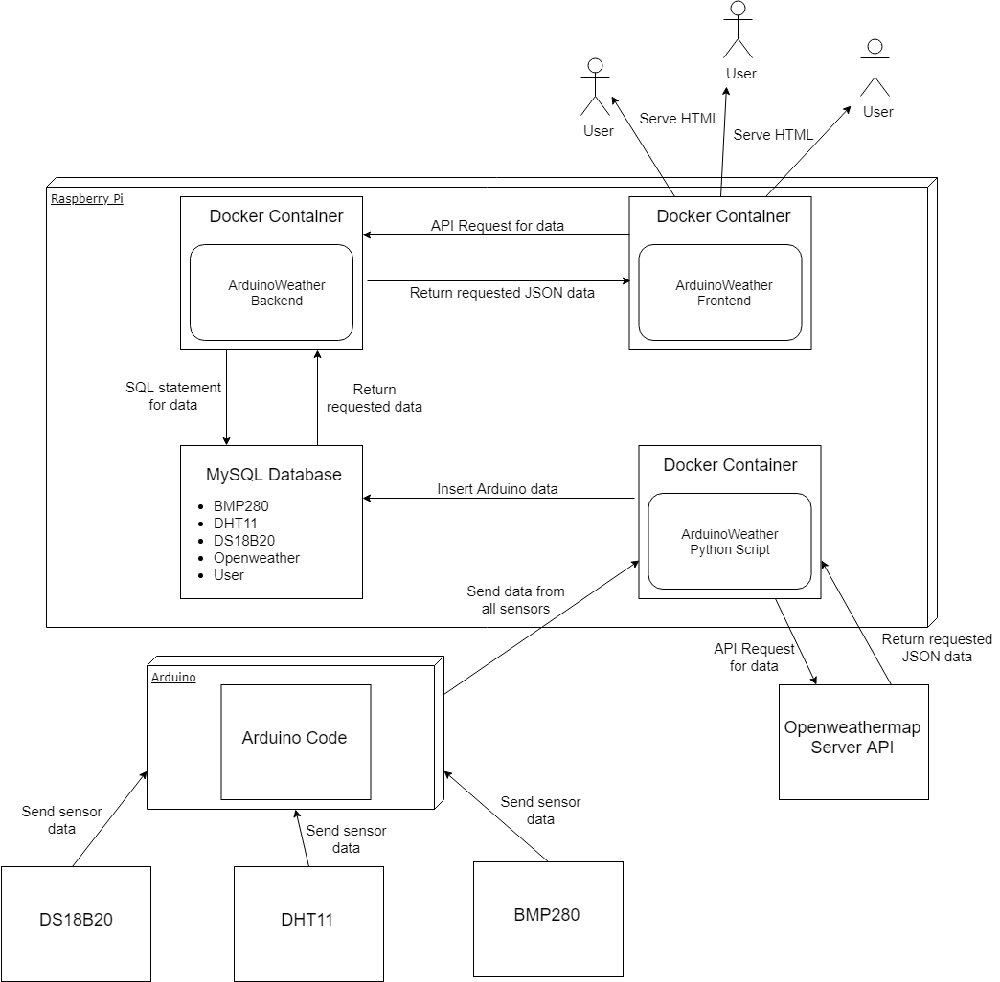

# ArduinoWeather

## WeatherStation for the Arduino and Raspberry Pi

The Weatherstation is a project by Tijmen Stor, created for two courses at the Amsterdam University of Applied Sciences.
The project is IoT (Internet of Things) based, having a sensor measure temperature et cetera in my home.

### The project contains the following folders
* arduino-code
	* Contains the code to be deployed on the Arduino.
* python-script
	* Contains a script that saves the data from the Arduino into a database.

The frontend and backend of this project have their own repositories for easier CI/CD pipelining. :)

Each of these folders contains their own respective information on what the folder exactly exists of and how to run it.
The following diagram shows the structure of this project as I had created it:

